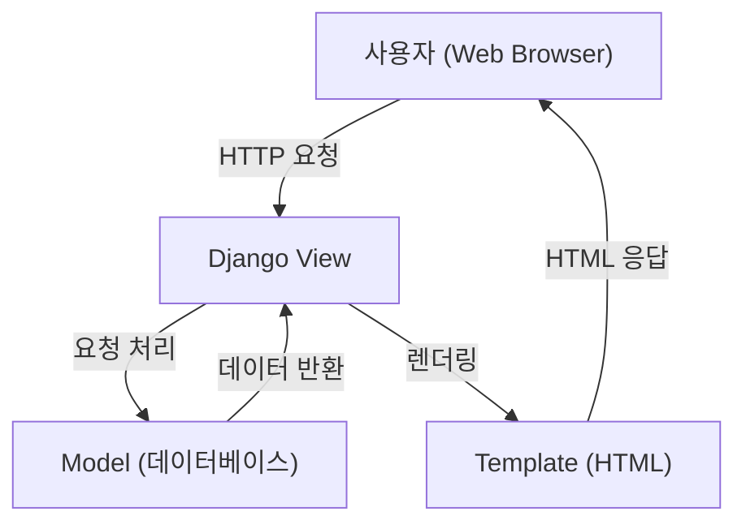

## **01. Django 프로젝트**

### **Django는 프로젝트를 단위로 움직입니다!**

Django는 하나의 프로젝트 단위로 웹 애플리케이션을 개발합니다. 이는 프로그램을 만들기 위한 기본 단위로, 하나의 프로젝트에서 여러 앱을 관리할 수 있습니다.

---

### **프로젝트 시작하기**

프로젝트를 시작하는 것은 곧 프로그램을 개발하기 위한 준비를 의미합니다. 다음은 프로젝트를 시작하는 일반적인 과정입니다:

1. 가상환경을 생성합니다.
2. 가상환경을 활성화합니다.
3. Django를 설치합니다.
4. 의존성 파일(`requirements.txt`)을 생성합니다.

#### **프로젝트 생성**

프로젝트를 생성하려면 아래 명령어를 사용하세요:

```python
django-admin startproject <프로젝트 이름> <생성 디렉토리>
```

> 생성 디렉토리를 생략하면 현재 위치에 프로젝트 이름의 폴더가 생성됩니다.

```python
django-admin startproject <프로젝트 이름> .
```

> 여기서 `.`은 현재 폴더를 의미하며, 현재 폴더를 프로젝트 폴더로 사용합니다.

---

### **실습하기**

#### 1. 프로젝트 생성

아래 명령어를 실행하여 프로젝트를 생성합니다:

```python
django-admin startproject my_first_pjt
```

> 프로젝트명은 원하는 이름으로 설정할 수 있지만, 처음에는 예제를 따라 동일하게 사용하는 것이 좋습니다.

명령 실행 후 생성된 폴더는 Django 프로젝트의 기본 구조를 포함하고 있습니다. 이 폴더 안에서 프로젝트를 진행합니다.

#### 2. 해당 폴더로 이동

생성된 프로젝트 폴더로 이동합니다:

```python
cd my_first_pjt
```

#### 3. Django 개발 서버 실행

Django 개발 서버를 실행하여 프로젝트가 정상적으로 설정되었는지 확인합니다:

```python
python manage.py runserver
```

서버가 성공적으로 실행되면 기본 제공되는 Django 환영 페이지를 브라우저에서 확인할 수 있습니다.

---

### **프로젝트 이해하기**

프로젝트 생성 후 폴더 구조는 아래와 같습니다:

```
my_first_pjt/
    manage.py
    my_first_pjt/
        __init__.py
        settings.py
        urls.py
        asgi.py
        wsgi.py
```

각 파일 및 폴더의 역할은 다음과 같습니다:

- **`manage.py`**: Django 프로젝트 유틸리티(명령 실행 도구).
- **`settings.py`**: 프로젝트의 설정을 관리.
- **`urls.py`**: URL 요청을 처리할 방법을 결정.
- **`__init__.py`**: 폴더를 파이썬 패키지로 인식하도록 함(3.x 버전 이후 없어도 무방).
- **`wsgi.py`**: 웹 서버 관련 설정 파일.

#### **핵심 파일 집중하기**

초기 학습 단계에서는 다음 두 파일에 집중하세요:

- **`settings.py`**: 프로젝트의 설정을 정의하고 관리.
- **`urls.py`**: URL과 뷰(view)를 연결하여 요청을 처리.

---

### **프로젝트란?**

- 프로젝트는 하나의 서비스 단위를 의미합니다. 예를 들어, A라는 웹사이트를 만든다면, A라는 프로젝트를 생성하게 됩니다.

#### **하나의 프로젝트는 하나의 기능만 하지 않습니다.**

우리가 흔히 이용하는 웹사이트들을 떠올려보세요:
- 예: Naver, Facebook
- 유저, 게시물, 채팅, 좋아요 등 여러 기능이 조합되어 있습니다.

#### **공통된 기능의 재사용**

만약 이러한 기능들을 한 번만 개발하고 재사용할 수 있다면?

→ **반복 작업을 줄이고 개발 효율성을 높일 수 있습니다!**

---

## **02. Django 앱(App)**

### **Django 앱이란?**

- Django의 **앱(App)**은 하나의 기능 단위를 의미합니다.
- 프로젝트는 여러 앱으로 구성될 수 있습니다.
- 하나의 앱으로 모든 기능을 개발할 수도 있지만, **여러 앱으로 나누어 개발**하는 것을 권장합니다.

#### **프로젝트와 앱의 차이**

- **프로젝트(Project)**: 어플리케이션의 집합체.
- **앱(App)**: 각각의 기능 단위 모듈.

---

### **App 사용하기**

앱을 사용하려면 두 가지 과정이 필요합니다:

1. **App 생성하기**
2. **App 등록하기**

#### **1. App 생성하기**

앱을 생성하려면 아래 명령어를 사용합니다:

```python
python manage.py startapp <앱 이름>
```

예를 들어, `articles`라는 앱을 생성하려면:

```python
python manage.py startapp articles
```

> 💡 Django에서는 앱 이름을 복수형으로 짓는 것이 권장됩니다.

앱 생성 후, 프로젝트 폴더 구조에 새로운 디렉토리가 추가됩니다:

```
my_first_pjt/
    articles/
        __init__.py
        admin.py
        apps.py
        models.py
        tests.py
        views.py
```

#### **2. App 등록하기**

생성된 앱을 프로젝트에서 사용하려면 **`settings.py`** 파일에 등록해야 합니다.

1. **`settings.py`** 파일을 엽니다.
2. `INSTALLED_APPS` 목록에 생성한 앱을 추가합니다:

```python
INSTALLED_APPS = [
    ...
    'articles',
]
```

> 💡 마지막에 쉼표를 추가하는 것을 권장합니다 (**Trailing commas**).

등록이 완료되면 Django에서 생성한 앱을 사용할 준비가 됩니다.

---

### **App 내부 파일 살펴보기**

생성된 앱 디렉토리는 여러 파일로 구성됩니다. 각 파일의 역할은 다음과 같습니다:

- **`admin.py`**: 관리자 페이지 관련 설정.
- **`apps.py`**: 앱의 설정 정보.
- **`models.py`**: 데이터베이스와 관련된 데이터 정의.
- **`tests.py`**: 테스트 코드 작성.
- **`views.py`**: 요청을 처리하고 응답을 반환.

---

## **03. Django의 디자인 패턴**

### **Django 디자인 패턴 이해하기**

Django가 작동하는 방식을 이해하려면 Django의 설계 철학과 디자인 패턴을 알아야 합니다. Django는 **MTV 패턴**을 기반으로 설계되었습니다.

> 사실 MTV 패턴은 MVC 패턴을 살짝 변형한 것입니다.

---

### **MVC 디자인 패턴**

**MVC**는 소프트웨어를 개발할 때 데이터와 로직, 화면 처리를 분리하는 데 사용하는 대표적인 설계 패턴입니다. 이는 하나의 큰 소프트웨어를 세 부분으로 나누어 생각할 수 있도록 도와줍니다.

#### **MVC의 역할**

- **Model**: 데이터와 관련된 로직을 관리합니다.
- **View**: 사용자에게 보여지는 화면과 레이아웃을 처리합니다.
- **Controller**: Model과 View를 연결하는 로직을 처리합니다.

#### **MVC의 장점**

- 관심사 분리로 인해 유지보수와 확장이 용이합니다.
- 각 부분을 독립적으로 개발할 수 있어 생산성이 향상됩니다.
- 다수의 개발자가 동시에 작업하기에도 적합합니다.

---

### **Django의 MTV 패턴**

Django는 MVC 패턴을 변형하여 **MTV 패턴**으로 설계되었습니다. 이름만 다를 뿐 역할은 거의 비슷합니다.

| **MVC** | **MTV** |
|---------|---------|
| Model   | Model   |
| View    | Template|
| Controller | View |

#### **MTV 패턴의 역할**

1. **Model**
    - 데이터와 관련된 로직을 처리합니다.
    - 데이터 구조를 정의하고 데이터베이스와의 상호작용을 관리합니다.

2. **Template**
    - 사용자에게 보여지는 화면과 레이아웃을 처리합니다.
    - HTML과 같은 UI 요소를 관리하며, MVC 패턴의 View에 해당합니다.

3. **View**
    - 클라이언트의 요청을 처리하고 응답을 생성하는 메인 로직을 담당합니다.
    - 데이터를 조회하거나 외부 요청을 수행하고, Template과 협력하여 응답을 반환합니다. 이는 MVC 패턴의 Controller 역할을 수행합니다.

---

### **MTV 패턴 한눈에 보기**



---

### **질문과 답변으로 정리하기**

1. **Django의 디자인 패턴은 무엇인가요?**
    - MVC 패턴을 변형한 **MTV 디자인 패턴**입니다.

2. **Django의 Model은 어떤 역할을 하나요?**
    - 데이터와 관련된 로직을 처리합니다.

3. **Django의 Template은 어떤 역할을 하나요?**
    - 사용자 화면과 관련된 처리를 담당합니다.

4. **Django의 View는 어떤 역할을 하나요?**
    - Model과 Template을 연결하고, 클라이언트 요청에 대해 메인 비즈니스 로직을 처리합니다.

---

## **04. 요청과 응답**

### **Django에서 요청과 응답 이해하기**

Django는 클라이언트의 요청(Request)을 받고, 처리한 후 응답(Response)을 반환하는 웹 프레임워크입니다. 이를 통해 우리가 원하는 데이터를 사용자에게 보여줄 수 있습니다.

---

### **요청과 응답의 흐름**

1. 클라이언트가 브라우저를 통해 요청(Request)을 보냅니다.
2. Django는 `urls.py` 파일을 참고해 어떤 View로 요청을 보낼지 결정합니다.
3. View(`views.py`)가 요청을 처리합니다.
4. 필요한 경우, Template(HTML 파일)로 데이터를 렌더링합니다.
5. 처리된 응답(Response)을 클라이언트에게 반환합니다.

```markdown
Request -> URLs -> View -> (Template) -> Response
```

---

### **실습: Hello, Django! 출력하기**

#### **1. URL 설정하기 (`urls.py` 파일 수정)**

`urls.py` 파일에서 URL과 View를 연결합니다.

```python
# my_first_pjt/my_first_pjt/urls.py

from django.contrib import admin
from django.urls import path
from articles import views

urlpatterns = [
    path("admin/", admin.site.urls),
    path("index/", views.index),
]
```

> 💡 **`path("index/", views.index)`**:
> `index/` 경로로 요청이 들어오면, `views.index` 함수로 전달합니다.

---

#### **2. View 작성하기 (`views.py` 파일 수정)**

View는 요청을 처리하고 응답을 반환하는 역할을 합니다. `views.py`에 아래 코드를 추가합니다.

```python
# my_first_pjt/articles/views.py

from django.http import HttpResponse

def index(request):
    response = HttpResponse("<h1>Hello, Django!</h1>")
    return response
```

> 💡 **`HttpResponse`**: 문자열 형태의 데이터를 클라이언트에게 반환합니다.

---

#### **3. 서버 실행하기**

Django 서버를 실행합니다.

```bash
python manage.py runserver
```

> **Tip**: 서버가 성공적으로 실행되면, 로컬호스트 주소(`http://127.0.0.1:8000/`)에서 Django 프로젝트를 확인할 수 있습니다.

---

#### **4. 브라우저에서 결과 확인하기**

1. `http://127.0.0.1:8000/index/` 주소로 이동합니다.
2. "Hello, Django!" 메시지가 화면에 표시됩니다.

```markdown
Request -> URLs (index/) -> View -> HttpResponse -> Browser
```

---

### **HTML 파일을 사용한 Template 렌더링**

#### **1. Template 사용하기 (`views.py` 수정)**

HTML 파일을 Template으로 사용하려면 `render` 함수를 활용합니다.

```python
# my_first_pjt/articles/views.py

from django.shortcuts import render

def index(request):
    return render(request, "index.html")
```

> 💡 **`render(request, "index.html")`**:
> `index.html` 파일을 렌더링하여 클라이언트에게 반환합니다.

---

#### **2. Template 파일 생성하기**

1. `articles/templates/` 디렉토리를 생성합니다.
2. `articles/templates/index.html` 파일을 생성하고 아래 내용을 추가합니다:

```html
<!DOCTYPE html>
<html lang="en">
  <head>
    <meta charset="UTF-8" />
    <meta name="viewport" content="width=device-width, initial-scale=1.0" />
    <title>My First Django PJT</title>
  </head>
  <body>
    <h1>My First Django Project</h1>
    <p>My first Django project is working!</p>
  </body>
</html>
```

---

#### **3. 결과 확인하기**

1. 서버를 실행합니다:

```bash
python manage.py runserver
```

2. `http://127.0.0.1:8000/index/`로 이동합니다.

3. "My First Django Project" 페이지가 정상적으로 표시됩니다.

---

### **뷰를 작성하는 두 가지 방법**

Django에서는 View를 작성하는 방법이 두 가지 있습니다:

1. **함수형 뷰 (Function-Based View)**:
   - View를 함수로 정의합니다.
   - 간단하고 직관적이며 초보자가 배우기에 적합합니다.

   ```python
   # articles/views.py
   from django.http import HttpResponse

   def index(request):
       return HttpResponse("<h1>Hello, Django!</h1>")
   ```

2. **클래스형 뷰 (Class-Based View)**:
   - View를 클래스 형태로 정의합니다.
   - 상속과 재사용이 용이하며, 복잡한 로직을 처리하기에 적합합니다.

   ```python
   # articles/views.py
   from django.http import HttpResponse
   from django.views import View

   class IndexView(View):
       def get(self, request):
           return HttpResponse("<h1>Hello, Django!</h1>")
   ```

> 💡 초보자에게는 **함수형 뷰**가 흐름을 이해하기 쉽기 때문에 권장됩니다. 이후 클래스형 뷰는 필요할 때 학습하면 됩니다.

---

### **정리: 요청과 응답의 흐름**

1. 클라이언트가 요청(Request)을 보냅니다.
2. Django의 `urls.py`에서 URL 매핑을 확인합니다.
3. 매핑된 View 함수가 실행됩니다.
4. View는 데이터를 처리하고, Template 파일을 렌더링하거나 HttpResponse를 반환합니다.
5. 클라이언트가 응답(Response)을 받습니다.
